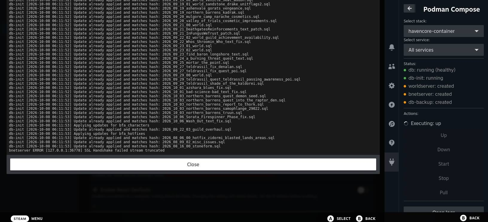

# Decky Podman Compose

A Decky Loader plugin for managing Podman Compose stacks on SteamOS.



## Support

This plugin is maintained primarily for personal use. 

- **GitHub Issues are turned off** and will not be accepted.
- **Pull Requests are welcome** and will be accepted if they are useful and do not add maintenance burden.

## Features

- Discover compose stacks under a configurable base directory
- Inline directory browser for picking the base directory
- Select a stack and optionally a single service
- Up / Down / Start / Stop / Pull whole stacks or individual services
- Live, scrollable logs with service-name prefixes
- Status indicator with color-coded health (green / yellow / red)
- Handles one-shot init containers that exit cleanly without showing the stack as partial

## Stacks directory layout

Set the **Stacks directory** in the plugin settings (e.g. `~/podman`).

Each stack must live in its **own subdirectory** under that base directory. The name of the subdirectory is used as the stack name in the plugin.

Example layout:

```
~/podman/
├── web/
│   └── container-compose.yml
├── minecraft/
│   └── container-compose.yml
│   └── container-compose.override.yml
└── database/
    └── docker-compose.yml
```

## Supported compose files

Inside each stack subdirectory, the plugin looks for one of the following compose files:

1. `docker-compose.yml`
2. `podman-compose.yml`
3. `container-compose.yml`

Override files (e.g. `container-compose.override.yml`) are merged automatically by `podman compose` because commands run from the stack's own directory.

## Install

1. Make sure [Decky Loader](https://deckyloader.org/) is installed on SteamOS.
2. Download the latest `decky-podman-compose-<VERSION>.zip` from the [Releases](../../releases) page.
3. In Game Mode, open the Quick Access Menu by pressing the **`...`** button.
4. Open **Decky Loader → Settings → General** and toggle on **Developer Mode**.
5. Switch to the **Developer** tab and select **Install Plugin from ZIP File**.
6. Browse to the downloaded ZIP and install it.
7. The plugin will appear in the Decky plugin list.

> [!NOTE]
> `podman` and `podman-compose` must be installed on SteamOS and available in `PATH` for this plugin to work.

## Status colors

- **Green** — `running`, `healthy`, or all services completed successfully
- **Yellow** — `partial`, `unhealthy`, `created`, containers still `starting`
- **Red** — `stopped`, `failed`, or `unknown`

## License

MIT. See LICENSE.
